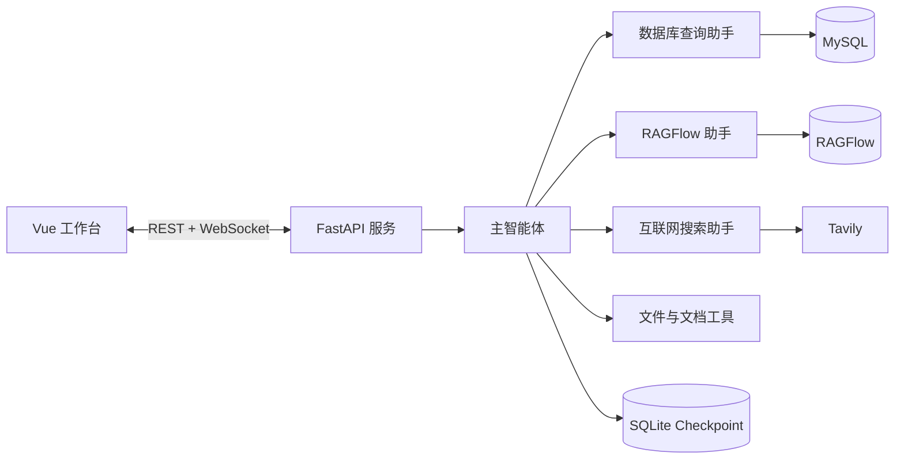

# DeepAgent Studio：多智能体驱动的企业级深度搜索与知识增强系统

[](https://www.python.org/)
[](https://fastapi.tiangolo.com/)
[](https://vuejs.org/)
[](https://langchain-ai.github.io/langgraph/)
[](https://github.com/langchain-ai/deepagents)
[](https://www.mysql.com/)
[](https://github.com/infiniflow/ragflow)
[](https://docs.astral.sh/uv/)

一个基于 FastAPI、Vue、DeepAgents 与 LangGraph 构建的多智能体深度搜索项目。主智能体会根据问题类型，将任务路由到数据库查询、RAGFlow 知识库或互联网搜索助手，并通过 WebSocket 向前端实时展示执行过程。

项目面向本地开发、技术学习和作品展示，重点演示多智能体编排、工具调用、知识库管理、结构化数据检索、联网搜索与会话记忆的完整协作流程。

## 功能截图

### 多智能体工作台


### 智能体执行过程与回答

主智能体会拆解复杂任务并连续调用多个能力。下图中的任务依次使用了 RAGFlow 助手、知识库文档列表工具和 Markdown 生成工具，最终产物会出现在会话文件栏中。


### RAGFlow 知识库管理

前端可以直接查看知识库和文档列表、上传文件、提交解析以及删除文档。


### RAGFlow 服务

RAGFlow 中配置的知识库与专业助手可以被项目中的 RAGFlow 子智能体调用。


## 核心能力

- **多智能体路由**：主智能体根据任务类型选择数据库、RAGFlow 或互联网搜索助手。
- **结构化数据查询**：通过 SQLModel/SQLAlchemy 查询 MySQL，并限制 Agent 只执行只读查询。
- **企业知识库管理**：支持列出知识库、查看文档、上传并解析文档、重新解析和删除文档。
- **RAGFlow 助手问答**：自动获取助手列表，选择合适的专业助手并发起提问。
- **互联网搜索**：通过 Tavily 检索公开资料，并在回答中保留原始来源链接。
- **文件分析**：读取 Markdown、TXT、Word、PDF 和 Excel 文件。
- **文档生成**：生成 Markdown，并可在 Windows + Microsoft Word 环境中转换为 PDF。
- **会话记忆**：使用 LangGraph SQLite Checkpointer 保存同一 `thread_id` 下的上下文。
- **实时执行过程**：FastAPI WebSocket 向前端推送子智能体调用、工具调用和最终结果。
- **项目 Skill**：通过 `skills/*/SKILL.md` 为智能体注入领域路由和操作流程。

## 系统架构



## 项目结构

```text
deep_agent_project/
├── agent/                 # 主智能体、模型和子智能体配置
├── api/                   # FastAPI、WebSocket、会话上下文和监控
├── prompt/                # 主智能体与子智能体提示词
├── skills/                # 项目内置 SKILL.md 工作流
├── tools/
│   ├── database/          # MySQL/SQLModel 查询工具
│   ├── document/          # Markdown 和 PDF 生成工具
│   ├── file/              # 本地文件读取工具
│   ├── ragflow/           # RAGFlow 知识库和助手工具
│   └── search/            # Tavily 互联网搜索工具
├── ui/                    # Vue 3 + TypeScript 前端
├── utils/                 # 路径与文档转换辅助模块
├── imgs_display/          # README 功能截图
├── pyproject.toml         # Python 直接依赖
└── uv.lock                # 可复现的 Python 依赖锁文件
```

运行时会自动创建 `runtime/`、`output/` 和 `updated/`。这些目录包含会话状态、生成文件和上传文件，默认不会提交到 Git。

## 环境要求

- Python 3.12+
- [uv](https://docs.astral.sh/uv/)
- Node.js 20+
- MySQL，可选；数据库查询功能需要
- RAGFlow，可选；知识库功能需要
- Tavily API Key，可选；联网搜索功能需要
- OpenAI 兼容的模型服务
- Microsoft Word，可选；当前 Markdown 转 PDF 工具使用 Word COM，仅支持 Windows

## 快速开始

### 1. 安装后端依赖

```powershell
uv sync --locked
```

`pyproject.toml` 是直接依赖清单，`uv.lock` 用于固定完整依赖版本。`requirements.txt` 由 uv 自动导出，仅用于兼容传统 pip 工作流。

### 2. 配置环境变量

```powershell
Copy-Item .env.example .env
```

编辑 `.env`，填写你实际使用的模型服务和可选数据源：

| 变量 | 用途 | 是否必填 |
| --- | --- | --- |
| `OPENAI_BASE_URL` | OpenAI 兼容接口地址 | 是 |
| `OPENAI_API_KEY` | 模型服务 API Key | 是 |
| `LLM_MODEL` | 接口实际支持的模型名 | 是 |
| `TAVILY_API_KEY` | 互联网搜索 | 使用联网搜索时 |
| `MYSQL_HOST` / `MYSQL_PORT` | MySQL 地址 | 使用数据库工具时 |
| `MYSQL_USER` / `MYSQL_PASSWORD` | MySQL 凭据 | 使用数据库工具时 |
| `MYSQL_DATABASE` | MySQL 数据库名 | 使用数据库工具时 |
| `RAGFLOW_API_URL` | RAGFlow API 地址 | 使用知识库时 |
| `RAGFLOW_API_KEY` | RAGFlow API Key | 使用知识库时 |

不要提交真实的 `.env` 文件。

### 3. 启动后端

在项目根目录执行：

```powershell
uv run api/server.py
```

后端默认地址：`http://127.0.0.1:8000`

### 4. 启动前端

新开一个 PowerShell 窗口：

```powershell
cd ui
npm ci
npm run dev
```

前端默认地址：`http://127.0.0.1:5173`

## 内置 Skills

| Skill | 作用 |
| --- | --- |
| `structured-data-query` | 将具体内部数据问题优先路由到数据库 |
| `database-query` | 规定先看表、再看字段、最后执行只读 SQL 的流程 |
| `ragflow-knowledge-base` | 管理知识库、文档和 RAGFlow 助手问答流程 |
| `web-research` | 处理公开互联网信息并保留来源链接 |
| `document-generation` | 生成 Markdown/PDF 文档 |

Skill 是智能体的任务说明和决策流程，Tool 是真正执行数据库查询、上传文档或互联网搜索的代码。

## 使用示例

可以在前端输入：

```text
查看 RAGFlow 中有哪些知识库
```

```text
把我上传的文件上传到空调安装知识库并解析
```

```text
查询数据库里的库存记录
```

```text
搜索 LangGraph 的最新资料，并给出原始来源链接
```

同一会话中的追问会复用当前 `thread_id` 和 SQLite 记忆。点击“新会话”后会生成新的 `thread_id`，适合开始一个无关任务。

## 开发验证

```powershell
uv lock --check
uv sync --locked
uv pip check
uv run python -m compileall -q agent api ragflow skills tools utils

cd ui
npm run build
```

## 当前边界

- 当前项目以本地单用户开发和能力展示为主，API 尚未加入登录、权限与限流。
- CORS 配置适合本地调试，不建议直接暴露到公网。
- SQLite Checkpointer 适合本地记忆；多实例部署应迁移到共享持久化存储。
- RAGFlow、MySQL、Tavily 等外部能力需要单独部署或申请对应服务。
- `ragflow/` 下的本地知识库原始资料默认被 Git 忽略，请根据数据授权自行准备测试文件。
