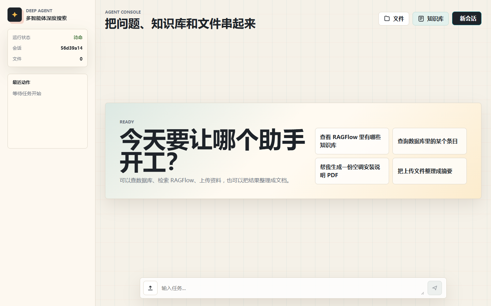
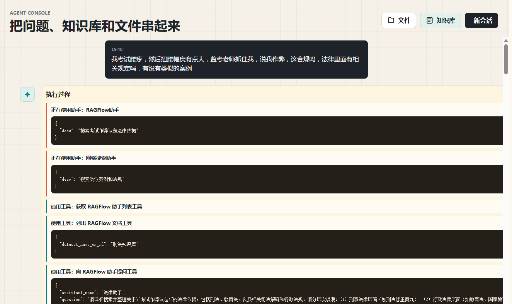
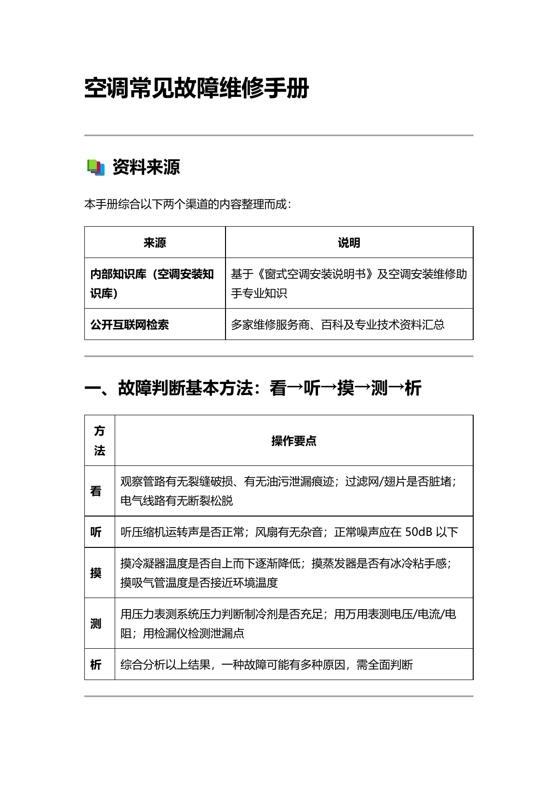
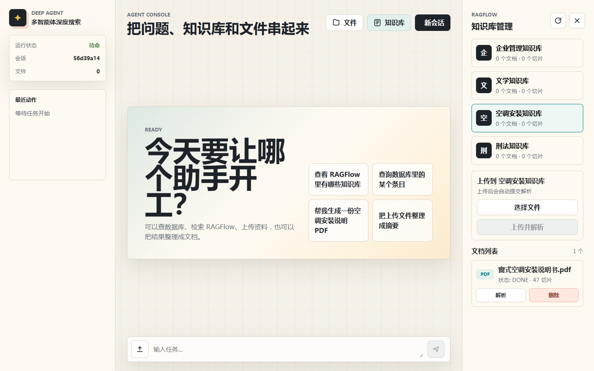
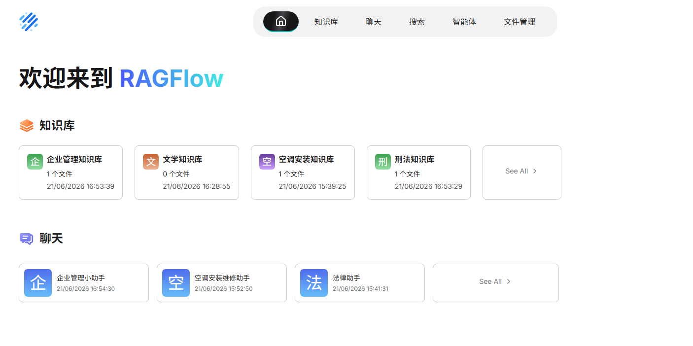
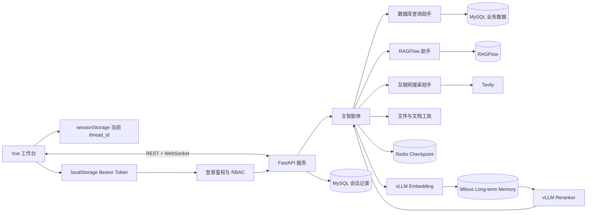

# DeepAgent Studio：多智能体驱动的企业级深度搜索与知识增强系统

[](https://www.python.org/)
[](https://fastapi.tiangolo.com/)
[](https://vuejs.org/)
[](https://langchain-ai.github.io/langgraph/)
[](https://github.com/langchain-ai/deepagents)
[](https://www.mysql.com/)
[](https://github.com/infiniflow/ragflow)
[](https://github.com/vllm-project/vllm)
[](https://milvus.io/)
[](https://redis.io/)
[](https://docs.astral.sh/uv/)

一个融合 Multi-Agent + Agentic RAG + 工具调用编排 + 实时可视化执行过程的企业级 AI 搜索与知识系统。

## 系统定位
本项目面向 Agentic AI 与企业知识系统场景：
- 多智能体任务调度机制
- 工具调用与路由决策系统
- 可扩展的企业知识增强系统设计

## 功能截图

### 多智能体工作台



### 智能体执行过程与回答

主智能体会拆解复杂任务并连续调用多个能力。下图中的任务依次使用了 RAGFlow 助手、知识库文档列表工具和 Markdown 生成工具，最终产物会出现在会话文件栏中。



### 示例：生成空调维修指南

例如，可以向主智能体提出一个需要知识库、互联网检索和文档工具协作的任务：

```text
请结合 RAGFlow 空调知识库和公开网络资料，整理一份空调常见故障维修指南，
包含故障判断方法、常见故障原因、处理建议、安全注意事项和日常保养建议，
最后生成 PDF 文件。
```

主智能体会根据任务调用 RAGFlow 助手和网络搜索助手收集资料，再使用文档工具生成结构化维修手册。下面是该任务生成的 PDF 首页：



[查看完整的空调常见故障维修手册 PDF](imgs_display/air-conditioner-maintenance-guide.pdf)

### RAGFlow 知识库管理

前端可以直接查看知识库和文档列表、上传文件、提交解析以及删除文档。



### RAGFlow 服务

RAGFlow 中配置的知识库与专业助手可以被项目中的 RAGFlow 子智能体调用。



## 核心能力

- **多智能体路由**：主智能体根据任务类型选择数据库、RAGFlow 或互联网搜索助手。
- **结构化数据查询**：通过 SQLModel/SQLAlchemy 查询 MySQL，并限制 Agent 只执行只读查询。
- **企业知识库管理**：支持列出知识库、查看文档、上传并解析文档、重新解析和删除文档。
- **RAGFlow 助手问答**：自动获取助手列表，选择合适的专业助手并发起提问。
- **互联网搜索**：通过 Tavily 检索公开资料，并在回答中保留原始来源链接。
- **文件分析**：读取 Markdown、TXT、Word、PDF 和 Excel 文件。
- **文档生成**：生成 Markdown，并可在 Windows + Microsoft Word 环境中转换为 PDF。
- **全生命周期记忆**：Redis Checkpointer 保存线程消息、任务计划和执行断点；Milvus 保存跨会话的偏好、规则、策略、模板和历史结论；MySQL 保存前端可恢复的聊天记录。
- **vLLM 检索推理服务**：Embedding 与 Reranker 解耦为独立 vLLM Pooling 服务，形成“向量化 → Milvus Top-K 召回 → Cross-Encoder 重排 → Top-N 上下文注入”链路。
- **实时执行过程**：FastAPI WebSocket 向前端推送子智能体调用、工具调用和最终结果。
- **API 安全控制**：基于 MySQL RBAC 实现用户、角色、权限管理，提供登录换取 Bearer Token、OAuth2 Scope 校验、WebSocket Token 校验和单进程内存限流。
- **可控服务生命周期**：FastAPI `lifespan` 统一初始化共享服务，关闭时取消并等待 Agent 与 WebSocket 后台任务，随后释放 Redis、Daytona 和事件循环资源。
- **原生 Agent Skill**：通过 DeepAgents `skills=` 与 `SkillsMiddleware` 按需发现和读取 `SKILL.md`，并为主 Agent、数据库、RAGFlow 和网络子 Agent 隔离不同 Skill。

## 核心亮点
- 🧩 多智能体架构：基于 LangGraph / DeepAgents 实现主智能体 + 子智能体协同调度
- 🔀 Agentic RAG：支持基于任务的动态路由（SQL / RAG / Web）
- 🗂 多源数据融合：MySQL + RAGFlow + Tavily 联合检索
- 🧠 智能任务拆解：主智能体自动规划执行步骤并调用工具链
- 📡 实时流式输出：通过 WebSocket 展示 Agent 思考与执行过程
- 📚 企业级知识库：集成 RAGFlow 实现文档检索与问答
- 🧾 结构化生成：支持 Markdown 报告自动生成与导出
- 💾 分层记忆：Redis 管理线程检查点，Milvus 管理用户级长期经验，MySQL 持久化前端聊天记录
- ⚡ 推理服务化：通过 vLLM 独立部署 BGE Embedding 与 Reranker，支持 OpenAI Embeddings API 和 Cohere Rerank API
- 🔐 API 鉴权：基于 MySQL RBAC、Bearer Token 与 Scope 控制任务、文件、知识库和会话接口访问

## 系统架构



## 项目结构

```text
deep_agent_project/
├── agent/                 # 主智能体、模型和子智能体配置
├── agent_memory/          # Milvus 用户级长期记忆
├── api/
│   ├── routers/           # 任务、文件、RAGFlow 与 WebSocket 路由
│   ├── schemas/           # Pydantic 请求模型
│   ├── services/          # 后台任务、文件与 RAGFlow 业务逻辑
│   ├── monitor.py         # WebSocket 执行事件监控
│   ├── security.py        # 登录、Token 和 Scope 权限校验
│   ├── rate_limit.py      # 单进程内存限流中间件
│   └── server.py          # FastAPI 装配与 lifespan
├── prompt/                # 主智能体与子智能体提示词
├── skills/                # 项目内置 SKILL.md 工作流
├── tools/
│   ├── database/          # MySQL/SQLModel 查询工具
│   ├── memory/            # 长期记忆检索与保存工具
│   ├── document/          # Markdown 和 PDF 生成工具
│   ├── file/              # 本地文件读取工具
│   ├── ragflow/           # RAGFlow 知识库和助手工具
│   └── search/            # Tavily 互联网搜索工具
├── ui/src/
│   ├── components/        # 聊天、执行过程、会话文件与知识库组件
│   ├── styles/            # 工作台全局样式
│   ├── utils/             # 前端格式化函数
│   ├── types.ts           # 前端共享类型
│   └── App.vue            # 页面状态与组件编排
├── utils/                 # 路径与文档转换辅助模块
├── imgs_display/          # README 功能截图
├── deploy/memory/         # Redis Stack 与 Milvus Docker Compose
├── deploy/vllm/           # Embedding 与 Reranker vLLM Docker Compose
├── pyproject.toml         # Python 直接依赖
└── uv.lock                # 可复现的 Python 依赖锁文件
```

运行时会自动创建 `runtime/`、`output/` 和 `updated/`。这些目录包含会话状态、生成文件和上传文件，默认不会提交到 Git。

后端路由只处理 HTTP/WebSocket 协议适配，具体操作由 `services/` 承担。前端 `App.vue` 保留状态与数据请求，各业务视图拆分到独立组件，便于继续扩展新工具和管理界面。

## 环境要求

- Python 3.12+
- [uv](https://docs.astral.sh/uv/)
- Node.js 20+
- MySQL，可选；数据库查询和聊天记录持久化需要，未配置时聊天记录功能会降级
- Docker；Redis Checkpointer 和 Milvus 长期记忆默认通过 Compose 运行
- RAGFlow，可选；知识库功能需要
- Tavily API Key，可选；联网搜索功能需要
- OpenAI 兼容的模型服务
- Microsoft Word，可选；当前 Markdown 转 PDF 工具使用 Word COM，仅支持 Windows

## 快速开始

### 1. 安装后端依赖

```powershell
uv sync --locked
```

`pyproject.toml` 是直接依赖清单，`uv.lock` 用于固定完整依赖版本。`requirements.txt` 由 uv 自动导出，仅用于兼容传统 pip 工作流。

### 2. 配置环境变量

```powershell
Copy-Item .env.example .env
```

编辑 `.env`，填写你实际使用的模型服务和可选数据源：

| 变量 | 用途 | 是否必填 |
| --- | --- | --- |
| `OPENAI_BASE_URL` | OpenAI 兼容接口地址 | 是 |
| `OPENAI_API_KEY` | 模型服务 API Key | 是 |
| `LLM_MODEL` | 接口实际支持的模型名 | 是 |
| `REDIS_CHECKPOINT_URL` | Redis Stack Checkpointer 地址 | 是 |
| `REDIS_CHECKPOINT_TTL_MINUTES` | 不活跃线程状态的保留时间 | 否 |
| `MILVUS_URI` | Milvus 服务地址 | 是 |
| `MILVUS_MEMORY_COLLECTION` | 长期记忆 Collection 名称 | 否 |
| `MEMORY_MIN_SIMILARITY` | 长期记忆召回最低相似度 | 否 |
| `MEMORY_EMBEDDING_PROVIDER` | 长期记忆向量服务，默认 `vllm` | 否 |
| `MEMORY_RERANKER_ENABLED` | 是否启用 vLLM Reranker | 否 |
| `VLLM_EMBEDDING_BASE_URL` | vLLM OpenAI Embeddings API 地址 | 是 |
| `VLLM_EMBEDDING_MODEL` | Embedding 模型名称 | 是 |
| `VLLM_RERANKER_BASE_URL` | vLLM Cohere Rerank API 地址 | 是 |
| `VLLM_RERANKER_MODEL` | Reranker 模型名称 | 是 |
| `DAYTONA_API_KEY` | Daytona 云沙箱 API Key | 是 |
| `DAYTONA_API_URL` | Daytona API 地址，默认 `https://app.daytona.io/api` | 否 |
| `DAYTONA_TARGET` | 沙箱区域；留空时使用组织默认区域 | 否 |
| `DAYTONA_COMMAND_TIMEOUT_SECONDS` | 沙箱命令最大执行时间 | 否 |
| `API_AUTH_ENABLED` | 是否启用 API 鉴权，默认 `true` | 否 |
| `API_AUTH_SECRET` | JWT 签名密钥，生产环境必须改成强随机值 | 是 |
| `API_TOKEN_EXPIRE_MINUTES` | 登录 Token 过期时间 | 否 |
| `API_ADMIN_USERNAME` / `API_ADMIN_PASSWORD` | 启动时自动创建或确保存在的管理员账号 | 是 |
| `API_SEED_DEMO_USERS` | 是否插入 `researcher`、`kb_manager`、`viewer` 模拟用户 | 否 |
| `API_RATE_LIMIT_REQUESTS` | 限流窗口内允许的请求数 | 否 |
| `API_RATE_LIMIT_WINDOW_SECONDS` | 限流窗口秒数 | 否 |
| `TAVILY_API_KEY` | 互联网搜索 | 使用联网搜索时 |
| `MYSQL_HOST` / `MYSQL_PORT` | MySQL 地址 | 使用数据库工具时 |
| `MYSQL_USER` / `MYSQL_PASSWORD` | MySQL 凭据 | 使用数据库工具时 |
| `MYSQL_DATABASE` | MySQL 数据库名 | 使用数据库工具时 |
| `RAGFLOW_API_URL` | RAGFlow API 地址 | 使用知识库时 |
| `RAGFLOW_API_KEY` | RAGFlow API Key | 使用知识库时 |

不要提交真实的 `.env` 文件。

### 启动记忆服务

```powershell
docker compose -p deep-agent-memory -f deploy/memory/docker-compose.yml up -d
```

默认端口：

- Redis Stack：`127.0.0.1:6380`
- Milvus：`127.0.0.1:19531`
- Milvus WebUI：`http://127.0.0.1:9092/webui/`

### 启动 vLLM 检索模型

项目使用两个独立的 vLLM Pooling 服务：

- `BAAI/bge-small-zh-v1.5`：通过 OpenAI 兼容的 `/v1/embeddings` 接口生成 512 维向量。
- `BAAI/bge-reranker-base`：通过 Cohere 兼容的 `/v1/rerank` 接口对 Milvus 候选结果重排。

```powershell
docker compose -p deep-agent-vllm -f deploy/vllm/docker-compose.yml up -d
```

默认服务地址：

- Embedding：`http://127.0.0.1:8001/v1`
- Reranker：`http://127.0.0.1:8002/v1`

检索流程首先从 Milvus 召回扩大后的候选集合，再调用 Reranker 计算 Query-Document 相关性分数并截取 Top-N。可以通过 `.env` 替换为其他 vLLM Pooling 模型或远程 GPU 服务；`MEMORY_ALLOW_HASH_FALLBACK=true` 可在推理服务不可用时启用本地降级。

### Daytona 沙箱

DeepAgents 的文件操作与 `execute` 命令默认运行在 Daytona 云沙箱中，而不是后端宿主机。同一个 `thread_id` 会复用同一个沙箱，不同会话相互隔离。用户上传的文件会在任务开始前同步到 `/home/daytona/workspace`，任务结束后生成文件会同步回本地会话目录。FastAPI 服务关闭时会删除本进程创建的沙箱，避免远端资源继续计费。

### 3. 启动后端

在项目根目录执行：

```powershell
uv run api/server.py
```

后端默认地址：`http://127.0.0.1:8000`

### 4. 启动前端

新开一个 PowerShell 窗口：

```powershell
cd ui
npm ci
npm run dev
```

前端默认地址：`http://127.0.0.1:5173`

首次打开前端时需要登录。服务启动时会在 MySQL 中自动创建 RBAC 表，并根据 `.env` 的 `API_ADMIN_USERNAME` 和 `API_ADMIN_PASSWORD` 初始化管理员账号；如果 `API_SEED_DEMO_USERS=true`，还会插入 `researcher`、`kb_manager`、`viewer` 三个模拟用户。登录成功后前端会把 Bearer Token 保存到 `localStorage`，普通 REST 请求放在 `Authorization` 头里，WebSocket 连接通过查询参数携带 token。

RBAC 数据表：

| 表名 | 作用 |
| --- | --- |
| `agent_rbac_users` | 用户和密码哈希 |
| `agent_rbac_roles` | 角色定义 |
| `agent_rbac_permissions` | 权限 scope 定义 |
| `agent_rbac_user_roles` | 用户和角色关系 |
| `agent_rbac_role_permissions` | 角色和权限关系 |

默认模拟账号：

| 用户名 | 默认密码 | 角色 |
| --- | --- | --- |
| `.env:API_ADMIN_USERNAME` | `.env:API_ADMIN_PASSWORD` | `admin` |
| `researcher` | `researcher123456` | `researcher` |
| `kb_manager` | `kb123456` | `knowledge_manager` |
| `viewer` | `viewer123456` | `viewer` |

当前内置权限 scope：

| Scope | 控制范围 |
| --- | --- |
| `task` | 运行智能体任务 |
| `files` | 上传、下载和查看会话文件 |
| `ragflow` | 查看知识库、上传/解析/删除知识库文档 |
| `conversations` | 创建会话和读取聊天记录 |

登录后可以访问 `GET /api/auth/rbac` 查看当前用户、角色、权限的种子数据快照，便于本地调试。

## 内置 Skills

| Skill | 作用 |
| --- | --- |
| `structured-data-query` | 将具体内部数据问题优先路由到数据库 |
| `database-query` | 规定先看表、再看字段、最后执行只读 SQL 的流程 |
| `ragflow-knowledge-base` | 管理知识库、文档和 RAGFlow 助手问答流程 |
| `web-research` | 处理公开互联网信息并保留来源链接 |
| `document-generation` | 生成 Markdown/PDF 文档 |
| `long-term-memory` | 跨会话召回或保存用户偏好、规则、策略、模板和历史结论 |

Skill 是智能体的任务说明和决策流程，Tool 是真正执行数据库查询、上传文档或互联网搜索的代码。项目使用 DeepAgents 原生渐进式披露机制：Agent 初始只看到 Skill 的名称、描述和路径，任务匹配后才读取完整 `SKILL.md`。主 Agent 使用路由和文档 Skill；数据库、RAGFlow、网络子 Agent 分别只加载各自的执行 Skill。Daytona 启动会把这些 Skill 同步到隔离的远端来源目录。

## 使用示例

可以在前端输入：

```text
查看 RAGFlow 中有哪些知识库
```

```text
查询数据库里的库存记录
```

```text
搜索 LangGraph 的最新资料，并给出原始来源链接
```

同一标签页中的追问会复用当前 `thread_id`。前端将该 ID 保存在 `sessionStorage`，刷新页面后会从 MySQL 恢复聊天记录，Redis Checkpointer 负责恢复 Agent 内部状态、任务计划和执行断点。点击“新会话”会生成新的 `thread_id`；新会话不会继承旧线程的原始聊天，但会按登录用户名从 Milvus 召回相关长期偏好、规则和历史结论。

## 开发验证

```powershell
uv lock --check
uv sync --locked
uv pip check
uv run python -m compileall -q agent agent_memory api ragflow skills tools utils

cd ui
npm run build
```

## 当前边界

- CORS 配置适合本地调试，不建议直接暴露到公网。
- vLLM 模型服务需要 NVIDIA GPU 和足够显存，也可以通过环境变量连接独立 GPU 服务器。
- 当前限流为单进程内存实现；多实例部署时应迁移到 Redis 限流。
- MySQL 当前保存聊天正文但尚未加入用户账号字段；正式多用户版本应增加 `user_id` 并按用户校验会话访问权限。
- RAGFlow、MySQL、Tavily 等外部能力需要单独部署或申请对应服务。
- `ragflow/` 下的本地知识库原始资料默认被 Git 忽略，请根据数据授权自行准备测试文件。
