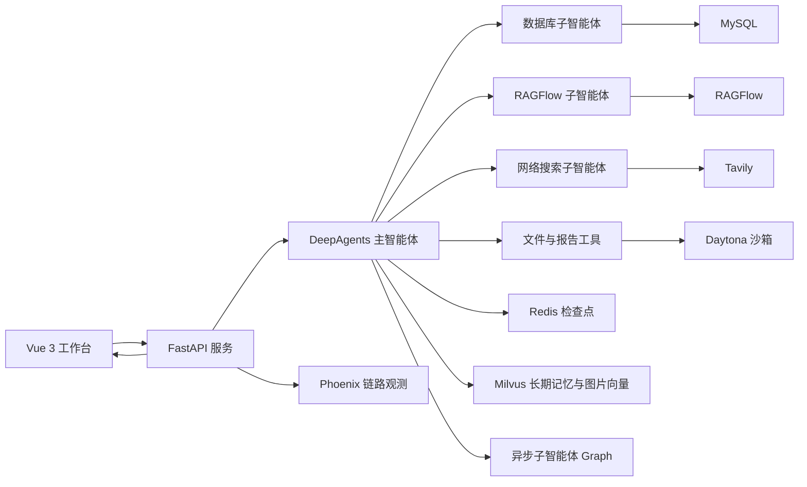

# OmniResearch：多智能体多模态深度研究系统

[](https://www.python.org/)
[](https://fastapi.tiangolo.com/)
[](https://vuejs.org/)
[](https://github.com/langchain-ai/deepagents)
[](https://github.com/infiniflow/ragflow)
[](https://redis.io/)
[](https://milvus.io/)
[](https://phoenix.arize.com/)
[](https://docs.astral.sh/uv/)

面向复杂研究任务的多智能体深度搜索系统。主智能体能够规划任务并协调数据库、企业知识库和互联网搜索子智能体，将文字、图片、结构化数据和文件组织为可追溯的回答或报告。

## 项目亮点

### 1. 多源信息不再依赖单一模型猜测

主智能体根据问题动态选择 MySQL、RAGFlow、Tavily 和本地文件工具；复杂任务可交给 DeepAgents 原生异步子智能体独立执行，降低长任务对主上下文的干扰。

### 2. 知识库从纯文本问答扩展到多模态检索

除 RAGFlow 文档问答外，系统可以检索 PDF 解析后的视觉 Chunk，并代理返回原始图片；用户私有图片通过多模态 Embedding 写入 Milvus，支持文搜图、图搜图和图文融合检索。

### 3. 会话、任务状态和长期经验分层保存

- **MySQL**：保存用户、RBAC 数据、会话和聊天消息，刷新页面后仍可恢复。
- **Redis**：保存 LangGraph 线程状态、任务计划和执行检查点。
- **Milvus**：保存跨会话的用户偏好、规则、策略和历史结论，并支持召回与重排。

### 4. Agent 执行过程可观察、可隔离、可控制

WebSocket 向前端实时推送子智能体和工具调用过程；Phoenix 通过 OpenTelemetry/OpenInference 展示完整调用链。代码与文件任务默认运行在 Daytona 临时沙箱中，API 侧提供 MySQL RBAC、Bearer Token、Scope 权限和请求限流。

## 系统架构



前后端通过 REST 接口提交和管理任务，通过 WebSocket 接收实时执行事件。

## 核心能力

| 能力 | 实现 |
| --- | --- |
| 多智能体编排 | 主智能体按任务路由数据库、RAGFlow、互联网搜索子智能体 |
| 异步研究任务 | 支持启动、查询、更新和取消独立后台子智能体任务 |
| 企业知识库 | 管理 RAGFlow 知识库与文档，调用专业助手问答，返回文档图片 |
| 多模态搜索 | 视觉模型理解图片，Milvus 支持文搜图、图搜图和融合检索 |
| 长短期记忆 | Redis 检查点、Milvus 长期记忆、MySQL 聊天记录分层管理 |
| 报告生成 | Markdown 结构化输出，通过 Typst 生成包含表格和图片的 PDF |
| Skill 系统 | 内置领域 Skill，并支持从 GitHub 安装后按用户和智能体隔离 |
| 安全与观测 | Daytona 沙箱、RBAC、API 限流、WebSocket 进度和 Phoenix Trace |

## 技术栈

- **Agent**：DeepAgents、LangGraph、LangChain
- **Backend**：Python 3.12、FastAPI、SQLModel、Pydantic Settings
- **Frontend**：Vue 3、TypeScript、Vite
- **Data**：MySQL、Redis、Milvus、RAGFlow
- **Model**：OpenAI 兼容 LLM、视觉模型、Embedding、Reranker，可连接 vLLM
- **Engineering**：uv、Docker Compose、Daytona、Phoenix、OpenTelemetry、Typst

## 快速开始

### 1. 安装依赖

```powershell
uv sync --locked

cd ui
npm install
cd ..
```

### 2. 配置环境变量

```powershell
Copy-Item .env.example .env
```

编辑 `.env`。完整配置已按中文模块说明，至少需要填写：

```dotenv
OPENAI_BASE_URL=https://your-model-service/v1
OPENAI_API_KEY=your-api-key
LLM_MODEL=your-model-name

MYSQL_HOST=127.0.0.1
MYSQL_PORT=3306
MYSQL_USER=your-user
MYSQL_PASSWORD=your-password
MYSQL_DATABASE=your-database
```

RAGFlow、Tavily、Daytona、Phoenix、视觉模型和 vLLM 均为按需配置。所有后端配置由 `core/settings.py` 统一读取和校验。

### 3. 启动 Redis 与 Milvus

```powershell
docker compose -p deep-agent-memory -f deploy/memory/docker-compose.yml up -d
```

### 4. 启动前后端

```powershell
# 终端 1：后端
uv run python -m api.server

# 终端 2：前端
cd ui
npm run dev
```

- 前端：`http://127.0.0.1:5173`
- 后端接口：`http://127.0.0.1:8000`
- OpenAPI：`http://127.0.0.1:8000/docs`

## 可选服务

### Phoenix 链路观测

```powershell
docker compose -p deep-agent-observability -f deploy/observability/docker-compose.yml up -d
```

访问 `http://127.0.0.1:6006` 查看 Agent、模型、工具和 LangGraph 节点调用链。

### vLLM Embedding 与 Reranker

```powershell
docker compose -p deep-agent-vllm -f deploy/vllm/docker-compose.yml up -d
```

将 `.env` 中的 `MEMORY_EMBEDDING_PROVIDER` 和 `MEMORY_RERANKER_PROVIDER` 设置为 `vllm` 后启用。

### 异步子智能体

```powershell
uv run langgraph dev
```

`langgraph.json` 已注册异步 Supervisor、网络研究、RAGFlow 研究和数据库研究 Graph，本地运行时使用进程内 ASGI 通信，不需要远程部署 URL。

## 项目结构

```text
deep_agent_project/
├── agent/                 # 主智能体、子智能体、异步 Graph 与运行时
├── agent_memory/          # Milvus 长期记忆与检索推理
├── api/                   # FastAPI 路由、服务、鉴权与 WebSocket
├── core/                  # 统一配置与安全路径解析
├── image_knowledge/       # 多模态向量与用户图片知识库
├── observability/         # Phoenix / OpenTelemetry 链路采集
├── skills/                # 内置 SKILL.md 与外部 Skill 管理
├── tools/                 # 数据库、RAGFlow、搜索、文件和文档工具
├── ui/                    # Vue 3 前端
├── deploy/                # Memory、Phoenix、vLLM Docker Compose
├── prompt/                # 主智能体与子智能体提示词
└── tests/                 # 后端单元测试
```

## 验证

```powershell
uv lock --check
uv pip check
uvx ruff check agent agent_memory api core image_knowledge observability skills tools tests
uv run python -m unittest discover -s tests -v

cd ui
npm run build
```

## 当前边界

- RAGFlow、MySQL、Tavily 和模型服务需要单独部署或申请。
- 默认限流器适用于单进程部署，多实例环境应替换为 Redis 分布式限流。
- vLLM 本地部署需要 NVIDIA GPU；也可以直接连接远程推理服务。
- 当前 CORS 配置面向本地开发，公网部署前应限制允许的来源。

更多工程说明见 [项目结构](docs/PROJECT_STRUCTURE.md)、[记忆设计](docs/MEMORY_DESIGN.md) 和 [开发验证](docs/DEVELOPMENT.md)。
